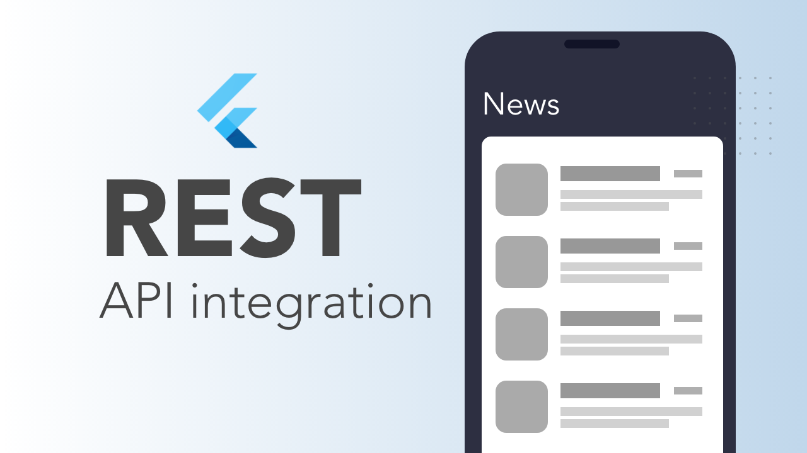

# Flutter News App Demo
This project is to showcase how to work with BLoC PATTERN & HttpClient in Flutter.

  

News API: http://newsapi.org/v2/everything?domains=wsj.com&apiKey=YOUR_API_KEY

<u>NOTE: Not to be used as is for Production. This code is for demonstration and doesn't cover all the cases and handling.</u>

## Getting Started

This project is a starting point for a Flutter application.

A few resources to get you started if this is your first Flutter project:

- [Lab: Write your first Flutter app](https://flutter.dev/docs/get-started/codelab)
- [Cookbook: Useful Flutter samples](https://flutter.dev/docs/cookbook)

For help getting started with Flutter, view our
[online documentation](https://flutter.dev/docs), which offers tutorials,
samples, guidance on mobile development, and a full API reference.
